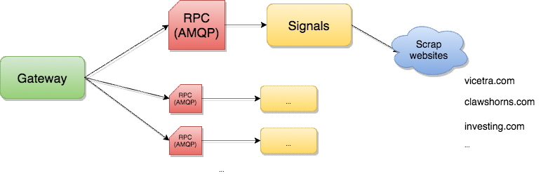

# Stock Market Signals API

*Scrapinghub this is for you!* 

## Overview

Currently investing in the financial market is becoming commonplace in people's lives. At all times new strategies, services and systems are emerging to automate the analysis and execution of investments.

This project aims to provide a Market Signals API for currency pairs like: EUR/USD, USD/JPY, GBP/USD, USD/CHF, EUR/GBP, EUR/JPY, EUR/CHF, AUD/USD, USD/CAD, NZD/USD
 and others minor pairs too.

Based on a microservice architecture, it can be deployed in any infrastructure.



#Solution Description

The project has, for the time being, a microservice and an API gateway.
The Microservice called Signals has a Web Scraper that obtains data from market signals from 3 of the major websites specialized in the financial market:
- vicetra.com
- clawshorns.com
- forexprostools.com

The request is made by API Gateway, it is sent to a processing queue of RabbitMQ that is serviced by the Signals microservice.
Currently the implementation has 2 resources:
- getAll (): Returns JSON with all data, statistical indicators and other information for each platform
- getValues (): Returns only the values (percentages) of CALL, PUT and NEUTRAL, and the one based on that, the investor or the system, can decide how to operate in the financial market.

## Prerequisites

* [Python 3](https://www.python.org/downloads/)
* [Docker](https://www.docker.com/)
* [Docker Compose](https://docs.docker.com/compose/)

## Libraries and Tools

- [Nameko](): Provide build microservice like easy way
- [RabbitMQ](): amazing a message-queueing software
- [CircleCI](): Awesome continuous integration
- [Docker](): ... just docker! <3 
- [Marshmallow](https://pypi.python.org/pypi/marshmallow) is used for validating, serializing and deserializing complex Python objects to JSON and vice versa in all services. 


### Repository structure
When developing Nameko services you have the freedom to organize your repo structure any way you want.


## Running Project

Quickest way to try out examples is to run them with Docker Compose

`$ docker-compose up`

Docker images for [RabbitMQ](https://hub.docker.com/_/rabbitmq/) will be automatically downloaded and their containers linked to example service containers.

When you see `Connected to amqp:...` it means services are up and running.

Gateway service with HTTP Api is listening on port 8003 and these endpoitns are available to play with:

#### Get All Signals

```sh
$ curl 'http://localhost:8003/signals/all'

{'clawshorns': {'bbands': 'down2',
  'data': 'USD/JPY',
  'ichimoku': 'right1',
  'intervalo': '5',
  'ma10': 'up2',
  'ma100': 'up2',
  'ma20': 'up2',
  'ma50': 'down2',
  'macd': 'up1',
  'moeda': 'USD/JPY',
  'movimento': 'Comprar ativo',
  'stochastic': 'up3',
  'williams': 'up1',
  'zigzag': 'right1'},
 'investingcom': {'moeda': 'USD/JPY',
  'movimento': 'Strong Buy',
  'valor': '113.56'},
 'vicentra': {'ADX(14)': {'Movimento': 'Buy', 'Valor': '30.653'},
  'ATR(14)': {'Movimento': 'Less Volatility', 'Valor': '0.0157'},
  'Bull/Bear Power(13)': {'Movimento': 'Buy', 'Valor': '0.0240'},
  'CCI(14)': {'Movimento': 'Buy', 'Valor': '91.3043'},
  'Compra': '9',
  'Data': '10/11',
  'Highs/Lows(14)': {'Movimento': 'Neutral', 'Valor': '0.0000'},
  'MACD(12,26)': {'Movimento': 'Buy', 'Valor': '0.020'},
  'Preço': '113.56',
  'ROC': {'Movimento': 'Buy', 'Valor': '0.009'},
  'RSI(14)': {'Movimento': 'Buy', 'Valor': '58.979'},
  'STOCH(9,6)': {'Movimento': 'Buy', 'Valor': '55.000'},
  'STOCHRSI(14)': {'Movimento': 'Buy', 'Valor': '67.856'},
  'Ultimate Oscillator': {'Movimento': 'Sell', 'Valor': '37.691'},
  'Venda': '1',
  'Williams %R': {'Movimento': 'Buy', 'Valor': '-40.000'},
  'moeda': 'USD/JPY',
  'movimento': 'Strong Buy'}
 }
```

## Running tests

Ensure RabbitMQ are running and `config.yaml` files for each service are configured correctly.

`$ make coverage`

`$ coverage run --append -m pytest signals/test`

## Testing Signal Service without docker-compose

Running RabbitMQ with Manager Plugin

```
docker run -d --hostname localhost --name rabbitmq -p 4369:4369 -p 5671:5671 -p 5672:5672 -p 15672:15672 rabbitmq
docker exec rabbitmq rabbitmq-plugins enable rabbitmq_management
```

Open on http://localhost:15672/#/

Running microservices units

```
$ nameko run --config config.yml signals.service
```

Open shell
```
$ nameko shell --config config.yml
```

Make queries on microservice
```
$ n.rpc.signals.getAll("USD/JPY")
```

# About me:
I am currently a CTO at Epitrack, a university professor and developer of solutions involving Deep Learning and Big Data. With more than 10 years of experience in the technology market, I am currently a PhD candidate in Artificial Intelligence and enthusiastic about new technologies, always attending to news that can accelerate scientific and technological development, generating impact and helping to improve people's lives.

#### Other interesting works:
- [$ 778.75 in one day investing in the financial market with a deep neural network](https://medium.com/@joaogabriellima/778-75-em-um-dia-investindo-no-mercado-financeiro-com-uma-deep-neural-network-2b5a917e31d4)
- [CoreML - Embedded and real-time deep learning on your iphone](https://medium.com/@joaogabriellima/coreml-deep-learning-embarcada-e-em-tempo-real-no-seu-iphone-ebed77d79a79)
- [Augmented Reality with React Native and iOS Arkit](https://medium.com/@joaogabriellima/realidade-aumentada-com-react-native-e-ios-arkit-4d76dce30679)


